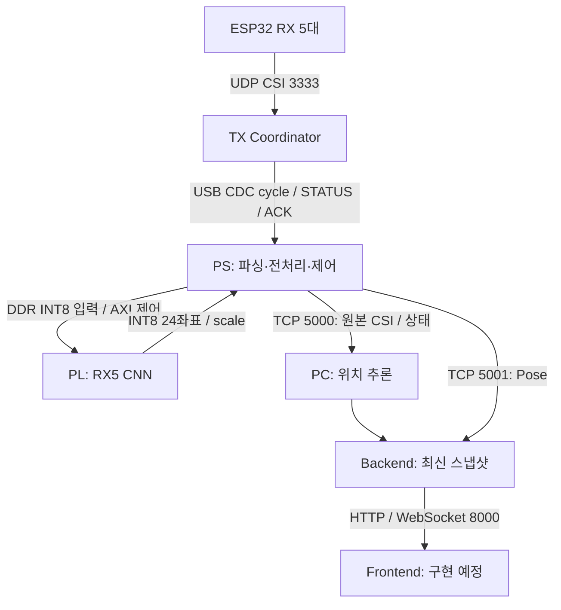

# 시스템 구조

현재 통합은 TX Coordinator 1대와 RX 5대입니다. TX가 RX CSI를 모아 USB CDC ACM으로 PS에 전달하며, 같은 cycle이 FPGA 자세 추정과 PC 위치 추론에 사용됩니다.

TX는 별도로 Wi-Fi trigger와 ESP-NOW assignment/mode를 RX에 보냅니다. 그림의 RX→TX 화살표는 측정한 CSI가 돌아오는 데이터 경로입니다. [펌웨어 안내](../esp32/README.md)에 무선/USB 구간을 설명합니다.

## 위치와 자세

| 경로 | 입력과 처리 | 결과 |
|---|---|---|
| 자세 | PS: raw CSI → HT-LTF remap/전처리 → 10프레임 INT8 `[15,128,10]`; PL: 공유 Encoder RX별 반복 → Flatten 5120 → FC128/128/24 | 12관절 `(x,y)`, `INT8 × output_scale` |
| 위치 | PS: 원본 cycle 전달; PC: RX0..4의 384 bytes/RX에서 2초 윈도우 특징 955개 → Portable Ridge | 11클래스, 대표 위치/사람 상태 |

두 경로는 계산 위치와 윈도우가 다릅니다. Backend가 최신 결과를 합쳐도 같은 시각의 위치/Pose로 강제 동기화하지 않습니다. 위치/Pose 각각의 유효성·stale를 확인하고 연결 종료/오래된 결과는 unavailable로 제공합니다. 미수신 데이터를 `empty`로 분류하지 않습니다.

현재 Frontend와 호흡 통합은 미구현입니다. 위치 모델은 [PC Backend](../pc/backend/README.md), Pose 학습은 [ML Pose](../ml/pose/README.md), RTL은 [PL CNN](../pl/cnn/README.md)에 있습니다.

## 소스에서 보드까지

원본 RTL은 `pl/cnn/rtl/`, 패키지 IP 복사본은 `integration/pose_cnn_1.1/src/`입니다. [INT8 계약](../ml/pose/INT8.md)을 통일했지만 기존 XSA/bitstream은 새로 생성하지 않았습니다. 새 최종 학습 모델의 golden을 만든 뒤 [Integration 빌드 순서](../integration/README.md)에 따라 IP/bitstream/XSA를 갱신하고 실제 보드와 비교해야 합니다.

실행 순서는 [bringup](bringup.md), tensor/CSR/TCP 구간은 [인터페이스](interface.md), 수행한 검증과 남은 trigger/윈도우 정책은 [점검 기록](reviews/2026-10-07-pc-integration.md)을 참고하세요.
