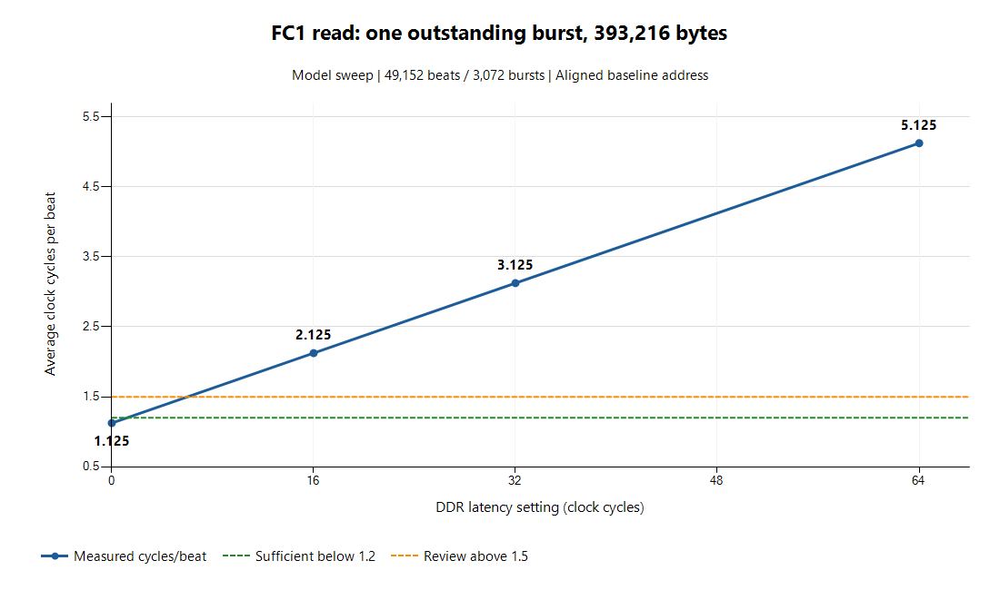

# T-02b — M00_AXI read 경로 검증·FC1 처리율 측정

날짜: 2026-09-25. **TB 구현·전체 실행 완료 / 명세 문구·구현 차이 2건 검수 필요.**

실물 M00과 T-02a 모형을 연결해 정상 읽기 기능 12건을 모두 통과했다.
총 4,511 word와 289개 AR 범위를 전량 검사했다. 처리율은 4개 지연 조건마다
49,152 word/3,072 burst를 검증했으며 모형 프로토콜 위반은 **0건**이다.
RTL·모형·기존 TB는 수정하지 않았다.

다만 **R3의 “마지막 burst만 16 beat 미만”과 R6의 무조건적인 “RREADY 직결”은 문자 그대로는 충족하지 않는다.**
전자는 필수 4 KiB 경계 분할과 충돌하는 문구이고, 후자는 M00의 실제 상태 한정 게이트와 다르다.
검사 결과를 숨겨 전체 계약 PASS로 처리하지 않았다. 기능 시험 PASS와 계약 검토 항목을 아래에 구분한다.
변경 여부는 사용자·Claude 검수에서 결정하며 T-02c는 시작하지 않았다.

## 1. 변경 파일·실행 범위

| 파일 | 역할 |
| --- | --- |
| [tb_m00_read.v](../testbench/tb_m00_read.v) | 실물 연결 fixture, 수락 AR·word 수집, 전량 scoreboard, R1~R7 기능 시험 12건 |
| [tb_m00_read_perf.v](../testbench/tb_m00_read_perf.v) | 같은 fixture를 사용해 지연 0/16/32/64를 별도 측정 |

`tb_m00_read.v`에는 `m00_read_fixture`와 기능 top `tb_m00_read`가 있다.
처리율 top은 fixture 정의를 사용하므로 두 TB 파일을 함께 컴파일하되 **각 top을 따로 elaboration/실행**한다.
처리율 실행에 기능 top의 initial은 들어가지 않는다.

실물 M00의 AXI 37개 포트를 모형에 같은 이름의 wire로 직결했다.
clock/reset은 M00의 `M_AXI_ACLK/M_AXI_ARESETN`을 모형의 `clk/resetn`에 연결했다.
쓰기 입력은 `mem_wr_start=0`, 주소·길이·데이터는 모두 알려진 0이며 쓰기 출력의 비활성도 감시한다.
C11은 모든 실행에서 켜 두었다. `expect_violation`과 오류 주입은 사용하지 않았다.

기존 RTL 3파일과 기존 TB 디렉터리 8파일(모형·자체 시험 포함), **총 11파일 SHA-256이 동일**하다.
합성, write, 오류 응답, RD_FAULT, watchdog/invalid_command, read/write 동시 시험은 이번 범위에 없다.

## 2. 검사 방식과 R1~R7 관측값

| 항목 | 실제 검사·관측 | 판정 |
| --- | --- | --- |
| R1 START/snapshot | 모든 명령에서 1-cycle START 수락 후 입력을 `addr=0xEE001000, bytes=8`로 변경. 원래 범위·데이터 유지. 136 B 시험에서는 busy 중 START 1회 추가, accepted=1/ignored=1, 종료 뒤 추가 실행 없음 | 기능 PASS |
| R2 busy | START 수락 전에는 0, 수락 에지 이후 1. 모든 수락 beat에서 busy=1. 마지막 word 수락 직후에만 하강. 1 beat=3 clocks, 16 beat=18 clocks, 17 beat=21 clocks | PASS |
| R3 burst 범위 | 모든 `(ARADDR, ARLEN+1)`을 배열에 수집하고 별도 계산으로 연속성·무중복·정확한 끝주소·16 beat·4 KiB 상한 확인 | 범위 PASS / “마지막만 짧음”은 검토 필요 |
| R4 AR payload | ARVALID인 모든 cycle에 SIZE/BURST/ID/LOCK/CACHE/PROT/QOS를 함께 확인. 모형도 C4/C5 및 stall 중 안정성 검사 | PASS |
| R5 데이터 | `mem_rd_data===RDATA`, 내부 수락과 AXI 수락 일치. 수집한 전체 word를 독립 주소 패턴과 `memory.mem_word` 양쪽에 대조 | PASS |
| R6 backpressure | READY 8 clocks LOW 동안 word 수 고정, VALID/DATA 유지 8회. 재개 후 전량 일치. READY 교대 및 AR/R gap 조합도 모두 일치 | 전달·stall PASS / 무조건 직결 등식은 불일치 |
| R7 크기별 | 아래 모든 크기와 4 KiB 경계 전/정확히/후 주소 시험. LOAD 실제 두 구간은 예상대로 47/187 burst | PASS |

독립 패턴은 `{seed ^ 32'hA5C39E71, byte_addr ^ seed}`다. 첫/끝 word만 보지 않는다.
기능 시험은 4,511개, 처리율은 각 49,152개를 **수집 후 전체 순서대로** 비교했다.
AR 목록도 수집 후 cursor를 다시 누적해 요청 끝주소와 정확히 일치하는지 계산했다.
기능 시험의 수락 AR 289개는 [CSV 원본](T-02b_AR기록.csv)에 남겼으며 Python으로도 연속·경계·끝주소를 재검산했다.

핵심 위치:

- [`tb_m00_read.v:213`](../testbench/tb_m00_read.v#L213): 에지 전 handshake 수집, START/busy, AR 상수·범위, R 데이터·stall 감시.
- [`tb_m00_read.v:291`](../testbench/tb_m00_read.v#L291): 수집한 전체 word와 전체 AR 목록의 독립 사후 대조.
- [`tb_m00_read.v:330`](../testbench/tb_m00_read.v#L330): 메모리 채움, START 자극, 입력 변경, busy 중 START 및 완료 후 idle 확인.
- [`tb_m00_read_perf.v:11`](../testbench/tb_m00_read_perf.v#L11): 네 지연 조건의 cycle 집계와 판단 기준 적용.

### busy 관측 시점 예: 8 B, 지연 0

START를 수락한 상승 에지를 `s`라 한다. START pulse는 그 앞 falling edge에서 올려 1 cycle 유지했다.

| 상승 에지 | 수락/동작 | busy |
| --- | --- | --- |
| s | START 수락, addr/bytes 저장 | 에지 전 0 → 에지 후 1 |
| s+1 | burst 계획 완료 | 1 |
| s+2 | AR 수락 | 1 |
| s+3 | 유일한 R word 수락 | 에지 전 1 → 에지 후 0 |

busy 지속 시간과 측정 총 cycle은 `완료 에지 번호 - START 수락 에지 번호`다.
TB가 신호를 구동한 falling edge부터의 반 cycle은 세지 않는다. 모든 명령에서 이 cycle 수와
실제로 busy=1을 샘플링한 횟수가 일치했다.

## 3. 크기별 결과와 stall 관측

| 시험 | 시작 주소 | bytes | 전량 비교 word | 예상/실제 burst | 총 cycle |
| --- | --- | ---: | ---: | ---: | ---: |
| 1 beat | 0x1E000000 | 8 | 1 | 1 / 1 | 3 |
| 16 beat | 0x1E000100 | 128 | 16 | 1 / 1 | 18 |
| 17 beat + busy START | 0x1E000200 | 136 | 17 | 2 / 2 | 21 |
| 4 KiB 경계 직전 | 0x1E001FF8 | 136 | 17 | 2 / 2 | 21 |
| 4 KiB 경계 정확히 | 0x1E002000 | 136 | 17 | 2 / 2 | 21 |
| 4 KiB 경계 직후 | 0x1E002008 | 4,096 | 512 | 33 / 33 | 578 |
| LOAD +0 | 0x1E020000 | 5,936 | 742 | 47 / 47 | 836 |
| LOAD +399,152 | 0x1E081730 | 23,840 | 2,980 | 187 / 187 | 3,354 |
| READY 8 clocks 정지 | 0x1E030000 | 136 | 17 | 2 / 2 | 29 |
| READY 매 cycle 교대 | 0x1E030100 | 512 | 64 | 4 / 4 | 135 |
| 교대 READY + 주기 AR/R gap | 0x1E030300 | 512 | 64 | 4 / 4 | 257 |
| 교대 READY + 난수 AR/R gap | 0x1E030600 | 512 | 64 | 4 / 4 | 255 |

| 흐름 제어 시험 | 실제 VALID 대기 cycle | 실제 ARREADY 대기 cycle | 데이터 대조 |
| --- | ---: | ---: | --- |
| READY 8 clocks LOW | 8 | 0 | 17/17 일치 |
| READY 교대 | 63 | 0 | 64/64 일치 |
| AR mode=1, gap=7 / R gap=2 / READY 교대 | 64 | 1 | 64/64 일치 |
| AR mode=2, seed=13572468 / R gap=2 / READY 교대 | 61 | 2 | 64/64 일치 |

AR mode=1은 전역 주기 위상에 따라 실제 대기량이 달라진다. gap=7을 넣었다는 사실로 통과시키지 않고
이 실행에서 실제 AR 대기 1 cycle, R 소비 대기 64 cycle이 있었음을 확인했다.
모든 정상 종료에서 `check_quiescent()`를 호출했으며 미완 전송은 없었다.

## 4. FC1 처리율 — 네 지연값의 실측

조건은 `addr=0x1E100000`(128 B 정렬), 393,216 B / 49,152 beats / 3,072 bursts,
`mem_rd_ready=1`, ARREADY 추가 stall=0, R gap=0이다. 모형의 `ddr_latency_cycles`만 바꿨다.
판단 기준은 실행 전 TB에 고정했다: **평균 <1.2면 해당 조건에서 충분, >1.5면 2~4 outstanding 검토 근거**.
그 사이 구간에 대해서는 별도 결론을 만들지 않는다.

| DDR 지연 설정 | START→완료 cycle | 평균 cycle/beat | burst 사이 유휴 합계 | 100 MHz 소요 시간 | xsim wall-clock |
| ---: | ---: | ---: | ---: | ---: | ---: |
| 0 | 55,296 | 1.125000 | 6,142 | 552.96 µs | 4.914 s |
| 16 | 104,448 | 2.125000 | 55,278 | 1,044.48 µs | 4.316 s |
| 32 | 153,600 | 3.125000 | 104,414 | 1,536.00 µs | 4.439 s |
| 64 | 251,904 | 5.125000 | 202,686 | 2,519.04 µs | 5.279 s |



4회 xsim wall-clock 합계는 **18.948 s**, 별도 처리율 top elaboration은 **3.158 s**였다.
기능 xsim은 **3.174 s**였다. wall-clock은 프로세스 시작·종료, 메모리 fill, 전량 비교를 포함하며
FPGA의 소요 시간과 다르다. 파형 기록 명령은 사용하지 않았다.

측정 정의:

- 총 cycle = 마지막 beat 수락으로 busy가 내려간 에지 − START 수락 에지.
- burst 사이 유휴 = 다음 burst 첫 beat 에지 − 이전 burst 마지막 beat 에지 − 1의 합.
  첫 burst 대기와 데이터 beat 자체는 제외한다. 총 3,071개 간격을 센다.
- 첫 전송 전 유휴는 각각 2/18/34/66 cycle이다.
  네 실행 모두 `총 cycle = 49,152 + burst 사이 유휴 + 첫 전송 전 유휴`가 정확히 성립했다.
- 100 MHz에서는 cycle당 10 ns이므로 소요 시간(µs) = cycle × 0.01이다.

정렬 기준선의 관측값은 `총 cycle=3,072×(18+L)`, `평균=1.125+L/16`,
`burst 간 유휴=3,071×(2+L)`와 일치한다. 이는 모형과 현재 상태기계에서 얻은 식이며
실제 Zynq DDR의 지연 분포를 측정한 결과가 아니다.

**판단:** L=0은 1.125<1.2로 해당 조건에서 충분하다. L=16/32/64는 모두 1.5를 넘으므로
1 outstanding의 burst 사이 대기가 큰 손실이라는 근거다. 실제 DDR 지연을 모르므로
“현재 보드에서 반드시 부족하다” 또는 “2~4개면 반드시 충분하다”고 단정하지 않는다.
다중 outstanding 적용은 M00 변경과 모형의 다중 burst 지원·검증까지 포함하는 별도 결정이다.

### 실제 FC1 offset과 정렬 기준선의 구분

명세 r73의 3,072 burst 조건을 재현하려고 이번 표는 정렬 주소를 사용했다.
4 KiB 정렬 weight base의 **실제 FC1 시작점 `base+5,936`**은 128 B 정렬이 아니다.
같은 393,216 B를 4 KiB 경계마다 끊으면 첫 경계에서 10 beat, 마지막에서 6 beat가 되어
독립 주소 계산상 **3,073 burst**가 필요하다. 이 실제 offset 구성은 이번 처리율 표에서 실행하지 않았다.
따라서 위 값은 FC1 **크기의 정렬 기준선**이며 실제 blob 배치의 exact 측정값으로 인용하면 안 된다.
지연 L에서 추가 1 burst의 차이는 이 모형/상태 진행식으로 2+L clocks로 예상되나 실측으로 표시하지 않는다.

## 5. 검수 필요 항목 — RTL·모형 수정 없음

### 5.1 R3: “마지막만 짧음”에는 4 KiB 예외가 필요

- 근거: 원문 `03_M00_AXI r70`은 16 beat 이하 **및 4 KiB를 넘지 않는** 분할을 요구한다.
  이번 작업 명세의 “마지막 burst만 16 beat 미만”은 경계 앞 주소와 동시에 만족할 수 없다.
- 재현: 기능 TB `boundary_before`, 주소 `0x1E001FF8`, 길이 136 B.
  수락 목록은 `(0x1E001FF8, 1 beat)` 다음 `(0x1E002000, 16 beats)`다.
  첫 burst를 16 beat로 만들면 4 KiB 경계를 넘는다.
- LOAD 두 번째 구간에서도 burst index 17의 `0x1E081FB0`가 10 beat로 경계에 끝난다.
  마지막 index 186 역시 10 beat지만 다른 이유(남은 길이)다. 총 burst 수는 여전히 187이다.
- 구현 위치: [`pose_cnn_v1_0_M00_AXI.v:109`](../rtl/pose_cnn_v1_0_M00_AXI.v#L109)의
  `burst_beats()` 및 116~118행의 경계 제한. 이 동작은 원문 r70에 맞는다.
- **제안(미확정):** 작업 명세를 “마지막 burst 또는 4 KiB 경계에 끝나는 burst는 16 beat 미만일 수 있다”로 보정.

### 5.2 R6: RREADY가 RD_DATA에서만 입력 ready를 따름

- 원문 `03_M00_AXI r14/r70`은 `RREADY=mem_rd_ready`라고 적는다.
- 실제 [`pose_cnn_v1_0_M00_AXI.v:145`](../rtl/pose_cnn_v1_0_M00_AXI.v#L145)는
  `assign M_AXI_RREADY = (rd_state == RD_DATA) && mem_rd_ready;`다.
- 재현: 기본 `size_8` 시험은 `mem_rd_ready=1`을 유지한다. START 수락 전 상태 및 PLAN/ADDR에서
  등식 불일치 3 cycle을 관측했다. busy 중의 PLAN/ADDR 2 cycle도 포함하므로 idle만의 차이는 아니다.
  처리율 각 실행에서는 active 시험 창 안의 불일치가 6,145 cycle이다.
- RVALID가 실제로 제시된 동안은 입력 ready와 항상 같았다. 정지 중 VALID/DATA 유지,
  재개 후 전량 일치 및 core/AXI handshake 일치를 통과했으므로 이번 정상 read 시험에서 데이터 손실은 없었다.
- **검수 결정 필요:** 문서가 상태 한정 ready를 허용하는지, RTL을 무조건 직결로 바꿀지 결정해야 한다.
  이 보고서는 어느 쪽도 확정하지 않으며 R6의 문자 그대로의 등식은 PASS로 표시하지 않는다.

모형 프로토콜 검사기가 잡은 위반은 **0건**이다. 모형 수정이 필요하다는 근거는 이번에 발견하지 못했다.

## 6. 검수 자료·실행 재현

- [기능 실행 명령·출력](T-02b_기능_실행로그.txt), [처리율 실행 명령·출력](T-02b_처리율_실행로그.txt)
- [기능 AR 전체 기록](T-02b_AR기록.csv), [처리율 CSV](T-02b_처리율.csv), [처리율 곡선](../../../docs/images/cnn/archive/T-02b_처리율.png)
- [결과·보존 파일 hash·포트 대조 집계](T-02b_결과집계.json)
- [처리율 wall-clock 원본](T-02b_perf_wall_clock.json), [기능 wall-clock 원본](T-02b_functional_wall_clock.json)

RTL은 `xvlog`, 모형·두 TB는 `xvlog -sv`로 컴파일했다.
최종 xvlog 및 두 top xelab 모두 오류·경고 0건이다.
Windows Vivado batch가 `name=value` 인자를 쪼개는 것을 피하기 위해 `-f` 옵션 파일에
`-testplusarg "LATENCY=16"` 같은 한 줄을 넣어 호출했다. 각 옵션 파일 내용도 실행 로그에 포함했다.
개발 중에는 TB의 초기 reset 관측을 첫 clock부터 reset이 유효하도록 보정했다. M00·모형 변경은 없었다.
실제 PASS 판정은 종료 코드와 함께 최종 PASS/FAIL/Fatal 출력까지 검사했다.

## 7. Notion 복사용 요약

```text
단계 ID / 제목 / 날짜: T-02b / M00 read 경로 검증·FC1 처리율 측정 / 2026-09-25
이번 목표와 전체 구조에서의 역할: 실물 M00 읽기를 검증하고 1 outstanding의 지연 손실을 정량화한다.
핵심 개념·신호: START snapshot, busy 종료 edge, 16-beat/4-KiB burst 분할, valid-ready 전달, backpressure.
동작 예: 0x1E001FF8에서 136 B 읽으면 1 beat + 16 beats로 분할한다. 4 KiB를 넘지 않기 위함이다.
변경 파일·핵심 위치: tb_m00_read.v(연결·전체 scoreboard), tb_m00_read_perf.v(4개 지연 측정) 신규.
확인 방법·실제 결과: Vivado 2020.2, 컴파일/두 top elaboration 오류·경고 0. 기능 12건/4,511 word/289 AR 전량 일치.
LOAD 관측: 5,936 B=742 word/47 burst, 23,840 B=2,980 word/187 burst. 프로토콜 위반 0건.
FC1 정렬 기준선: 393,216 B/49,152 beat/3,072 burst, ready=1. DDR 지연 0/16/32/64 sweep.
평균 cycle/beat: 1.125 / 2.125 / 3.125 / 5.125.
총 cycle: 55,296 / 104,448 / 153,600 / 251,904.
burst 간 idle: 6,142 / 55,278 / 104,414 / 202,686.
100 MHz 시간: 552.96 / 1,044.48 / 1,536.00 / 2,519.04 us.
판단: 지연0 조건만 <1.2. 나머지는 >1.5라 다중 outstanding 검토 근거. 실제 DDR 지연 미측정, 변경 결정은 별도.
명세 검토: R3는 4-KiB 경계의 중간 짧은 burst 예외 필요. R6는 실제 RREADY가 RD_DATA 상태 한정이므로 무조건 직결 문구와 다름.
주소 주의: 실제 blob의 base+5,936은 독립 계산상 3,073 burst. 이번 표는 정렬 기준선이며 실제 offset 실측은 아님.
보존/범위: RTL·모형·기존 TB 11파일 해시 동일. write/오류/watchdog/동시 진행·outstanding 확대는 하지 않음.
실행 시간: 기능 xsim 3.174 s, 처리율 4회 합계 18.948 s(시작/종료·fill·전량 비교 포함).
현재 상태: 구현·실행 완료, 계약 문구/구현 차이 검수 필요. Notion 직접 기록은 하지 않음.
내가 추가로 정리할 내용: 완료 edge와 마지막 handshake의 관계, DDR 대기를 숨기지 못하는 1 outstanding의 한계.
다음 단계 후보: T-02c — write 경로 검증 (미착수).
```

## 8. 실행 명령과 출력 전문

### 기능 시험

```text
Working directory: C:\Users\kccistc\AppData\Local\Temp\codex-t02b-2493975729ff478bb9e5238e682dfd47\sim

COMMAND: C:/Xilinx/Vivado/2020.2/bin/xvlog.bat D:\2609_final_project\cnn_rtl\rtl\pose_cnn_v1_0_M00_AXI.v
INFO: [VRFC 10-2263] Analyzing Verilog file "D:/2609_final_project/cnn_rtl/rtl/pose_cnn_v1_0_M00_AXI.v" into library work
INFO: [VRFC 10-311] analyzing module pose_cnn_v1_0_M00_AXI

EXIT_CODE: 0
WALL_CLOCK_SECONDS: 0.879015

COMMAND: C:/Xilinx/Vivado/2020.2/bin/xvlog.bat -sv D:\2609_final_project\cnn_rtl\tb\axi4_slave_mem_model.v D:\2609_final_project\cnn_rtl\tb\tb_m00_read.v D:\2609_final_project\cnn_rtl\tb\tb_m00_read_perf.v
INFO: [VRFC 10-2263] Analyzing SystemVerilog file "D:/2609_final_project/cnn_rtl/tb/axi4_slave_mem_model.v" into library work
INFO: [VRFC 10-311] analyzing module axi4_slave_mem_model
INFO: [VRFC 10-2263] Analyzing SystemVerilog file "D:/2609_final_project/cnn_rtl/tb/tb_m00_read.v" into library work
INFO: [VRFC 10-311] analyzing module m00_read_fixture
INFO: [VRFC 10-311] analyzing module tb_m00_read
INFO: [VRFC 10-2263] Analyzing SystemVerilog file "D:/2609_final_project/cnn_rtl/tb/tb_m00_read_perf.v" into library work
INFO: [VRFC 10-311] analyzing module tb_m00_read_perf

EXIT_CODE: 0
WALL_CLOCK_SECONDS: 0.822375

COMMAND: C:/Xilinx/Vivado/2020.2/bin/xelab.bat work.tb_m00_read -s t02b_read
Vivado Simulator 2020.2
Copyright 1986-1999, 2001-2020 Xilinx, Inc. All Rights Reserved.
Running: C:/Xilinx/Vivado/2020.2/bin/unwrapped/win64.o/xelab.exe work.tb_m00_read -s t02b_read 
Multi-threading is on. Using 14 slave threads.
Starting static elaboration
Pass Through NonSizing Optimizer
Completed static elaboration
Starting simulation data flow analysis
Completed simulation data flow analysis
Time Resolution for simulation is 1ps
Compiling module work.pose_cnn_v1_0_M00_AXI
Compiling module work.axi4_slave_mem_model
Compiling module work.m00_read_fixture
Compiling module work.tb_m00_read
Built simulation snapshot t02b_read

EXIT_CODE: 0
WALL_CLOCK_SECONDS: 2.273389
ARGS_FILE: C:\Users\kccistc\AppData\Local\Temp\codex-t02b-2493975729ff478bb9e5238e682dfd47\sim\functional.args
-testplusarg "AR_TRACE=ar_trace.csv"

COMMAND: C:/Xilinx/Vivado/2020.2/bin/xsim.bat t02b_read -runall -onerror quit -f functional.args

****** xsim v2020.2 (64-bit)
  **** SW Build 3064766 on Wed Nov 18 09:12:45 MST 2020
  **** IP Build 3064653 on Wed Nov 18 14:17:31 MST 2020
    ** Copyright 1986-2020 Xilinx, Inc. All Rights Reserved.

source xsim.dir/t02b_read/xsim_script.tcl
# xsim {t02b_read} -testplusarg AR_TRACE=ar_trace.csv -autoloadwcfg -runall -onerror quit
Vivado Simulator 2020.2
Time resolution is 1 ps
run -all
PASS: size_8 R1/R2 snapshot+busy words=1 bursts=1 expected=1 cycles=3 busy_samples=3 accepted_start=1 ignored_start=0
PASS: size_8 R3/R4/R5 cover_bytes=8 compared_words=1 AR_constant_checks=1 nonfinal_boundary_short=0
PASS: size_8 R6 transfer/stall ready_checks=1 held_valid_cycles=0 ar_wait=0 protocol_violations=0
OBSERVATION: size_8 literal_RREADY_direct_mismatch_cycles=3 (state-qualified RTL; data-phase equality passed)
PASS: size_128 R1/R2 snapshot+busy words=16 bursts=1 expected=1 cycles=18 busy_samples=18 accepted_start=1 ignored_start=0
PASS: size_128 R3/R4/R5 cover_bytes=128 compared_words=16 AR_constant_checks=1 nonfinal_boundary_short=0
PASS: size_128 R6 transfer/stall ready_checks=16 held_valid_cycles=0 ar_wait=0 protocol_violations=0
OBSERVATION: size_128 literal_RREADY_direct_mismatch_cycles=3 (state-qualified RTL; data-phase equality passed)
PASS: size_136_snapshot_busy_start R1/R2 snapshot+busy words=17 bursts=2 expected=2 cycles=21 busy_samples=21 accepted_start=1 ignored_start=1
PASS: size_136_snapshot_busy_start R3/R4/R5 cover_bytes=136 compared_words=17 AR_constant_checks=2 nonfinal_boundary_short=0
PASS: size_136_snapshot_busy_start R6 transfer/stall ready_checks=17 held_valid_cycles=0 ar_wait=0 protocol_violations=0
OBSERVATION: size_136_snapshot_busy_start literal_RREADY_direct_mismatch_cycles=5 (state-qualified RTL; data-phase equality passed)
PASS: boundary_before R1/R2 snapshot+busy words=17 bursts=2 expected=2 cycles=21 busy_samples=21 accepted_start=1 ignored_start=0
PASS: boundary_before R3/R4/R5 cover_bytes=136 compared_words=17 AR_constant_checks=2 nonfinal_boundary_short=1
PASS: boundary_before R6 transfer/stall ready_checks=17 held_valid_cycles=0 ar_wait=0 protocol_violations=0
OBSERVATION: boundary_before literal_RREADY_direct_mismatch_cycles=5 (state-qualified RTL; data-phase equality passed)
SPEC_NOTE: boundary_before has 1 legal non-final short burst(s) ending at 4-KiB boundaries
PASS: boundary_exact R1/R2 snapshot+busy words=17 bursts=2 expected=2 cycles=21 busy_samples=21 accepted_start=1 ignored_start=0
PASS: boundary_exact R3/R4/R5 cover_bytes=136 compared_words=17 AR_constant_checks=2 nonfinal_boundary_short=0
PASS: boundary_exact R6 transfer/stall ready_checks=17 held_valid_cycles=0 ar_wait=0 protocol_violations=0
OBSERVATION: boundary_exact literal_RREADY_direct_mismatch_cycles=5 (state-qualified RTL; data-phase equality passed)
PASS: boundary_after R1/R2 snapshot+busy words=512 bursts=33 expected=33 cycles=578 busy_samples=578 accepted_start=1 ignored_start=0
PASS: boundary_after R3/R4/R5 cover_bytes=4096 compared_words=512 AR_constant_checks=33 nonfinal_boundary_short=1
PASS: boundary_after R6 transfer/stall ready_checks=512 held_valid_cycles=0 ar_wait=0 protocol_violations=0
OBSERVATION: boundary_after literal_RREADY_direct_mismatch_cycles=67 (state-qualified RTL; data-phase equality passed)
SPEC_NOTE: boundary_after has 1 legal non-final short burst(s) ending at 4-KiB boundaries
PASS: load_part1 R1/R2 snapshot+busy words=742 bursts=47 expected=47 cycles=836 busy_samples=836 accepted_start=1 ignored_start=0
PASS: load_part1 R3/R4/R5 cover_bytes=5936 compared_words=742 AR_constant_checks=47 nonfinal_boundary_short=0
PASS: load_part1 R6 transfer/stall ready_checks=742 held_valid_cycles=0 ar_wait=0 protocol_violations=0
OBSERVATION: load_part1 literal_RREADY_direct_mismatch_cycles=95 (state-qualified RTL; data-phase equality passed)
PASS: load_part2 R1/R2 snapshot+busy words=2980 bursts=187 expected=187 cycles=3354 busy_samples=3354 accepted_start=1 ignored_start=0
PASS: load_part2 R3/R4/R5 cover_bytes=23840 compared_words=2980 AR_constant_checks=187 nonfinal_boundary_short=1
PASS: load_part2 R6 transfer/stall ready_checks=2980 held_valid_cycles=0 ar_wait=0 protocol_violations=0
OBSERVATION: load_part2 literal_RREADY_direct_mismatch_cycles=375 (state-qualified RTL; data-phase equality passed)
SPEC_NOTE: load_part2 has 1 legal non-final short burst(s) ending at 4-KiB boundaries
PASS: ready_hold_8 R1/R2 snapshot+busy words=17 bursts=2 expected=2 cycles=29 busy_samples=29 accepted_start=1 ignored_start=0
PASS: ready_hold_8 R3/R4/R5 cover_bytes=136 compared_words=17 AR_constant_checks=2 nonfinal_boundary_short=0
PASS: ready_hold_8 R6 transfer/stall ready_checks=25 held_valid_cycles=8 ar_wait=0 protocol_violations=0
OBSERVATION: ready_hold_8 literal_RREADY_direct_mismatch_cycles=5 (state-qualified RTL; data-phase equality passed)
PASS: ready_alternate R1/R2 snapshot+busy words=64 bursts=4 expected=4 cycles=135 busy_samples=135 accepted_start=1 ignored_start=0
PASS: ready_alternate R3/R4/R5 cover_bytes=512 compared_words=64 AR_constant_checks=4 nonfinal_boundary_short=0
PASS: ready_alternate R6 transfer/stall ready_checks=127 held_valid_cycles=63 ar_wait=0 protocol_violations=0
OBSERVATION: ready_alternate literal_RREADY_direct_mismatch_cycles=4 (state-qualified RTL; data-phase equality passed)
PASS: combined_periodic_stalls R1/R2 snapshot+busy words=64 bursts=4 expected=4 cycles=257 busy_samples=257 accepted_start=1 ignored_start=0
PASS: combined_periodic_stalls R3/R4/R5 cover_bytes=512 compared_words=64 AR_constant_checks=5 nonfinal_boundary_short=0
PASS: combined_periodic_stalls R6 transfer/stall ready_checks=128 held_valid_cycles=64 ar_wait=1 protocol_violations=0
OBSERVATION: combined_periodic_stalls literal_RREADY_direct_mismatch_cycles=5 (state-qualified RTL; data-phase equality passed)
PASS: combined_random_stalls R1/R2 snapshot+busy words=64 bursts=4 expected=4 cycles=255 busy_samples=255 accepted_start=1 ignored_start=0
PASS: combined_random_stalls R3/R4/R5 cover_bytes=512 compared_words=64 AR_constant_checks=6 nonfinal_boundary_short=0
PASS: combined_random_stalls R6 transfer/stall ready_checks=125 held_valid_cycles=61 ar_wait=2 protocol_violations=0
OBSERVATION: combined_random_stalls literal_RREADY_direct_mismatch_cycles=4 (state-qualified RTL; data-phase equality passed)
PASS: T-02b FUNCTIONAL 12/12 CASES, ALL COLLECTED WORDS AND AR RANGES CHECKED; protocol violations=0
REVIEW: literal R3 last-short-only excludes necessary 4-KiB splits; literal R6 direct RREADY differs outside RD_DATA; no RTL/model edits
$finish called at time : 55947 ns : File "D:/2609_final_project/cnn_rtl/tb/tb_m00_read.v" Line 419
exit
INFO: [Common 17-206] Exiting xsim at Fri Sep 25 21:09:26 2026...

EXIT_CODE: 0
WALL_CLOCK_SECONDS: 3.173672
```

### 처리율 시험 4회

```text
Working directory: C:\Users\kccistc\AppData\Local\Temp\codex-t02b-2493975729ff478bb9e5238e682dfd47\sim

COMMAND: C:/Xilinx/Vivado/2020.2/bin/xelab.bat work.tb_m00_read_perf -s t02b_read_perf
Vivado Simulator 2020.2
Copyright 1986-1999, 2001-2020 Xilinx, Inc. All Rights Reserved.
Running: C:/Xilinx/Vivado/2020.2/bin/unwrapped/win64.o/xelab.exe work.tb_m00_read_perf -s t02b_read_perf 
Multi-threading is on. Using 14 slave threads.
Starting static elaboration
Pass Through NonSizing Optimizer
Completed static elaboration
Starting simulation data flow analysis
Completed simulation data flow analysis
Time Resolution for simulation is 1ps
Compiling module work.pose_cnn_v1_0_M00_AXI
Compiling module work.axi4_slave_mem_model
Compiling module work.m00_read_fixture
Compiling module work.tb_m00_read_perf
Built simulation snapshot t02b_read_perf

****** Webtalk v2020.2 (64-bit)
  **** SW Build 3064766 on Wed Nov 18 09:12:45 MST 2020
  **** IP Build 3064653 on Wed Nov 18 14:17:31 MST 2020
    ** Copyright 1986-2020 Xilinx, Inc. All Rights Reserved.

source C:/Users/kccistc/AppData/Local/Temp/codex-t02b-2493975729ff478bb9e5238e682dfd47/sim/xsim.dir/t02b_read_perf/webtalk/xsim_webtalk.tcl -notrace
INFO: [Common 17-206] Exiting Webtalk at Fri Sep 25 21:09:38 2026...

EXIT_CODE: 0
WALL_CLOCK_SECONDS: 3.158290
ARGS_FILE: C:\Users\kccistc\AppData\Local\Temp\codex-t02b-2493975729ff478bb9e5238e682dfd47\sim\latency_0.args
-testplusarg "LATENCY=0"

COMMAND: C:/Xilinx/Vivado/2020.2/bin/xsim.bat t02b_read_perf -runall -onerror quit -f latency_0.args

****** xsim v2020.2 (64-bit)
  **** SW Build 3064766 on Wed Nov 18 09:12:45 MST 2020
  **** IP Build 3064653 on Wed Nov 18 14:17:31 MST 2020
    ** Copyright 1986-2020 Xilinx, Inc. All Rights Reserved.

source xsim.dir/t02b_read_perf/xsim_script.tcl
# xsim {t02b_read_perf} -testplusarg LATENCY=0 -autoloadwcfg -runall -onerror quit
Vivado Simulator 2020.2
Time resolution is 1 ps
run -all
PASS: fc1_latency_0 R1/R2 snapshot+busy words=49152 bursts=3072 expected=3072 cycles=55296 busy_samples=55296 accepted_start=1 ignored_start=0
PASS: fc1_latency_0 R3/R4/R5 cover_bytes=393216 compared_words=49152 AR_constant_checks=3072 nonfinal_boundary_short=0
PASS: fc1_latency_0 R6 transfer/stall ready_checks=49152 held_valid_cycles=0 ar_wait=0 protocol_violations=0
OBSERVATION: fc1_latency_0 literal_RREADY_direct_mismatch_cycles=6145 (state-qualified RTL; data-phase equality passed)
PERF: latency=0 bytes=393216 beats=49152 bursts=3072 cycles=55296 cycles_per_beat=1.125000 inter_burst_idle=6142 startup_idle=2 time_us_100mhz=552.96 judgement=one_outstanding_sufficient_under_this_latency
PASS: T-02b PERFORMANCE MEASUREMENT COMPLETE; all words checked, C11 enabled, violations=0
$finish called at time : 553077 ns : File "D:/2609_final_project/cnn_rtl/tb/tb_m00_read_perf.v" Line 41
exit
INFO: [Common 17-206] Exiting xsim at Fri Sep 25 21:09:43 2026...

EXIT_CODE: 0
WALL_CLOCK_SECONDS: 4.914338
ARGS_FILE: C:\Users\kccistc\AppData\Local\Temp\codex-t02b-2493975729ff478bb9e5238e682dfd47\sim\latency_16.args
-testplusarg "LATENCY=16"

COMMAND: C:/Xilinx/Vivado/2020.2/bin/xsim.bat t02b_read_perf -runall -onerror quit -f latency_16.args

****** xsim v2020.2 (64-bit)
  **** SW Build 3064766 on Wed Nov 18 09:12:45 MST 2020
  **** IP Build 3064653 on Wed Nov 18 14:17:31 MST 2020
    ** Copyright 1986-2020 Xilinx, Inc. All Rights Reserved.

source xsim.dir/t02b_read_perf/xsim_script.tcl
# xsim {t02b_read_perf} -testplusarg LATENCY=16 -autoloadwcfg -runall -onerror quit
Vivado Simulator 2020.2
Time resolution is 1 ps
run -all
PASS: fc1_latency_16 R1/R2 snapshot+busy words=49152 bursts=3072 expected=3072 cycles=104448 busy_samples=104448 accepted_start=1 ignored_start=0
PASS: fc1_latency_16 R3/R4/R5 cover_bytes=393216 compared_words=49152 AR_constant_checks=3072 nonfinal_boundary_short=0
PASS: fc1_latency_16 R6 transfer/stall ready_checks=49152 held_valid_cycles=0 ar_wait=0 protocol_violations=0
OBSERVATION: fc1_latency_16 literal_RREADY_direct_mismatch_cycles=6145 (state-qualified RTL; data-phase equality passed)
PERF: latency=16 bytes=393216 beats=49152 bursts=3072 cycles=104448 cycles_per_beat=2.125000 inter_burst_idle=55278 startup_idle=18 time_us_100mhz=1044.48 judgement=review_2_to_4_outstanding
PASS: T-02b PERFORMANCE MEASUREMENT COMPLETE; all words checked, C11 enabled, violations=0
$finish called at time : 1044597 ns : File "D:/2609_final_project/cnn_rtl/tb/tb_m00_read_perf.v" Line 41
exit
INFO: [Common 17-206] Exiting xsim at Fri Sep 25 21:09:48 2026...

EXIT_CODE: 0
WALL_CLOCK_SECONDS: 4.316277
ARGS_FILE: C:\Users\kccistc\AppData\Local\Temp\codex-t02b-2493975729ff478bb9e5238e682dfd47\sim\latency_32.args
-testplusarg "LATENCY=32"

COMMAND: C:/Xilinx/Vivado/2020.2/bin/xsim.bat t02b_read_perf -runall -onerror quit -f latency_32.args

****** xsim v2020.2 (64-bit)
  **** SW Build 3064766 on Wed Nov 18 09:12:45 MST 2020
  **** IP Build 3064653 on Wed Nov 18 14:17:31 MST 2020
    ** Copyright 1986-2020 Xilinx, Inc. All Rights Reserved.

source xsim.dir/t02b_read_perf/xsim_script.tcl
# xsim {t02b_read_perf} -testplusarg LATENCY=32 -autoloadwcfg -runall -onerror quit
Vivado Simulator 2020.2
Time resolution is 1 ps
run -all
PASS: fc1_latency_32 R1/R2 snapshot+busy words=49152 bursts=3072 expected=3072 cycles=153600 busy_samples=153600 accepted_start=1 ignored_start=0
PASS: fc1_latency_32 R3/R4/R5 cover_bytes=393216 compared_words=49152 AR_constant_checks=3072 nonfinal_boundary_short=0
PASS: fc1_latency_32 R6 transfer/stall ready_checks=49152 held_valid_cycles=0 ar_wait=0 protocol_violations=0
OBSERVATION: fc1_latency_32 literal_RREADY_direct_mismatch_cycles=6145 (state-qualified RTL; data-phase equality passed)
PERF: latency=32 bytes=393216 beats=49152 bursts=3072 cycles=153600 cycles_per_beat=3.125000 inter_burst_idle=104414 startup_idle=34 time_us_100mhz=1536.00 judgement=review_2_to_4_outstanding
PASS: T-02b PERFORMANCE MEASUREMENT COMPLETE; all words checked, C11 enabled, violations=0
$finish called at time : 1536117 ns : File "D:/2609_final_project/cnn_rtl/tb/tb_m00_read_perf.v" Line 41
exit
INFO: [Common 17-206] Exiting xsim at Fri Sep 25 21:09:52 2026...

EXIT_CODE: 0
WALL_CLOCK_SECONDS: 4.439022
ARGS_FILE: C:\Users\kccistc\AppData\Local\Temp\codex-t02b-2493975729ff478bb9e5238e682dfd47\sim\latency_64.args
-testplusarg "LATENCY=64"

COMMAND: C:/Xilinx/Vivado/2020.2/bin/xsim.bat t02b_read_perf -runall -onerror quit -f latency_64.args

****** xsim v2020.2 (64-bit)
  **** SW Build 3064766 on Wed Nov 18 09:12:45 MST 2020
  **** IP Build 3064653 on Wed Nov 18 14:17:31 MST 2020
    ** Copyright 1986-2020 Xilinx, Inc. All Rights Reserved.

source xsim.dir/t02b_read_perf/xsim_script.tcl
# xsim {t02b_read_perf} -testplusarg LATENCY=64 -autoloadwcfg -runall -onerror quit
Vivado Simulator 2020.2
Time resolution is 1 ps
run -all
PASS: fc1_latency_64 R1/R2 snapshot+busy words=49152 bursts=3072 expected=3072 cycles=251904 busy_samples=251904 accepted_start=1 ignored_start=0
PASS: fc1_latency_64 R3/R4/R5 cover_bytes=393216 compared_words=49152 AR_constant_checks=3072 nonfinal_boundary_short=0
PASS: fc1_latency_64 R6 transfer/stall ready_checks=49152 held_valid_cycles=0 ar_wait=0 protocol_violations=0
OBSERVATION: fc1_latency_64 literal_RREADY_direct_mismatch_cycles=6145 (state-qualified RTL; data-phase equality passed)
PERF: latency=64 bytes=393216 beats=49152 bursts=3072 cycles=251904 cycles_per_beat=5.125000 inter_burst_idle=202686 startup_idle=66 time_us_100mhz=2519.04 judgement=review_2_to_4_outstanding
PASS: T-02b PERFORMANCE MEASUREMENT COMPLETE; all words checked, C11 enabled, violations=0
$finish called at time : 2519157 ns : File "D:/2609_final_project/cnn_rtl/tb/tb_m00_read_perf.v" Line 41
exit
INFO: [Common 17-206] Exiting xsim at Fri Sep 25 21:09:57 2026...

EXIT_CODE: 0
WALL_CLOCK_SECONDS: 5.278639
```
