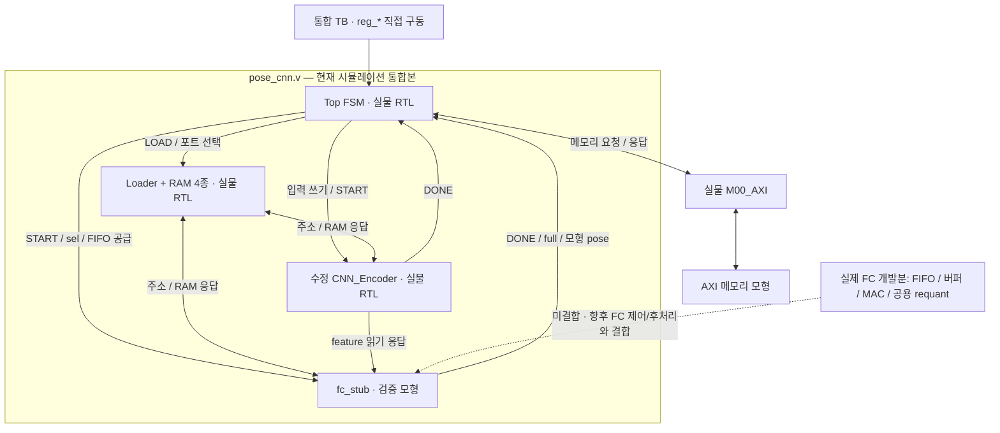

# 인계 범위와 모듈 의존관계

작성: 2026-09-27. 대상: S00_AXI·Top FSM·Loader 업무를 이어받는 팀원.
기준: 이 인계 폴더에 보존한 RTL과 검증 기록. 이후 팀원의 변경본까지 검증했다는 의미는 아니다.

## 1. 인수할 것은 코드와 그 코드가 동작하는 연결 조건이다

한림 담당으로 구현한 핵심은 **S00_AXI, Top FSM, Loader와 상주 RAM**이다.
이를 개발하는 과정에서 Encoder·FC의 데이터 형식, RAM 읽기 지연, 시작·완료 신호, 오류 복구 조건까지 반영했다.
따라서 담당 RTL 몇 개만 가져오면 어떤 상대 모듈을 전제로 검증했는지 빠질 수 있다.

현재의 정확한 인계 상태는 다음과 같다.

> 핵심 담당 기능은 명세·확정 결정에 따라 구현하고, 단계별 TB와 수정 Encoder·FC 모형을 사용해 검증했다.
> 수정 Encoder는 실제 연결했고 출력도 참고 C++ golden과 비교했다.
> 별도로 개발한 실제 FC 부품은 아직 코어에 결합하지 않았다.
> 실물 FC를 포함한 전체 추론·최종 타이밍·보드 통합은 후속 작업으로 남아 있다.

**담당 범위와 검증 의존관계는 별개다.** Encoder·FC 자료를 함께 넘기는 이유는 검증 기준을 재현하고 교체 조건을 알리기 위해서다.
팀원이 그 구현을 반드시 채택해야 한다는 뜻은 아니며, 채택·변경 결정은 담당자와 팀에 있다.

## 2. 파일의 출처와 현재 역할

아래 경로는 인계 폴더의 `pl/cnn` 기준이다. [RTL 폴더](../../../rtl)를 함께 보면 된다.

| 구분 | 파일 | 현재 역할과 인수 범위 |
|---|---|---|
| 핵심 담당 — CSR | `rtl/pose_cnn_v1_0_S00_AXI.v` | Xilinx AXI 템플릿에 CSR 제어를 구현. START/CLEAR·주소·STATUS 인터페이스 |
| 핵심 담당 — Top | `rtl/pose_cnn_ctrl.v` | LOAD/INFER/출력/오류 처리 13상태와 블록 제어 |
| 핵심 담당 — Loader | `rtl/weight_param_loader.v`, `rtl/blob_decoder.v` | blob 해석·저장·설정 유효성·읽기 포트 선택 |
| 핵심 담당 — RAM | `rtl/conv_weight_ram.v`, `rtl/param_ram.v`, `rtl/gelu_lut_ram.v`, `rtl/fcw_ram.v` | Loader가 채우고 Encoder·FC가 읽는 RAM 4종. Loader와 함께 인수 |
| 팀원 코드 수정 | `rtl/pose_cnn_v1_0_M00_AXI.v` | 민영 코드 기반. 동기식 reset 및 reset 중 VALID 처리 수정, 별도 검증 기록 포함 |
| 코어 연결 | `rtl/pose_cnn.v` | ctrl + Loader + 수정 Encoder + **fc_stub** 배선. S00/M00는 코어 밖 |
| Encoder 작업본 | `rtl/CNN_Encoder/` | 동우 원본 기반으로 Buffer 등 수정. 현재 통합에서 사용한 버전 |
| FC 검증 모형 | `testbench/fc_stub.v` | FIFO·완료·RAM 접근을 시험하기 위한 모형. 실제 CNN의 FC 연산은 하지 않음 |
| 실제 FC 개발분 | `rtl/fc_work/` | FIFO·hidden/pose 버퍼·MAC 구현. **pose_cnn 내부에 아직 연결되지 않음** |
| 공유 requant | `rtl/CNN_Encoder/requant_stage.v` | Encoder 기본값과 FC 파라미터 구성을 지원. FC 경로는 별도 TB에서 검증 |

핵심 담당 RTL은 위 S00/Top/Loader/RAM **8개 파일**이다. M00 수정본·코어 배선·상대 모듈과 검증 자료까지 함께 제공한다.
FC 디렉터리에 requant가 없는 것은 누락이 아니다. Encoder 디렉터리의 공용 모듈을 사용한다.

## 3. 실제 연결된 구성과 아직 연결하지 않은 구성

그림의 점선은 현재 연결이 아니라 향후 모형을 실물 FC로 교체할 위치다.
S00는 별도 TB와 CSR↔Top 연결 시험으로 검증했다. X-02a/G-02 통합 TB에서는 `reg_*`를 직접 구동하므로,
이 결과가 PS→S00→실물 FC→DDR까지 최종 IP 전체를 검증한 것은 아니다.

실제 연결은 [pose_cnn.v](../../../rtl/pose_cnn.v)의 `u_ctrl`, `u_loader`, `u_encoder`, `u_fc`를 보면 확인할 수 있다.
`u_fc`의 모듈명은 **fc_stub**이다. 현재 이 파일은 완성된 합성 top이 아니다.

## 4. 네 담당 부분에 상대 모듈의 무엇이 반영됐는가

| 네 쪽 구현 | 반영한 연결 조건 | 다른 구현으로 교체할 때 확인할 것 |
|---|---|---|
| Top의 IN_RD→ENC | 입력 1,440개 64-bit word를 기록한 뒤 `enc_start`, `enc_done`까지 대기 | 입력 포트 폭·주소·저장 순서와 완료 시점. Top은 Encoder 실행 시간을 고정 카운터로 기다리지 않음 |
| Top의 ENC→FC1 | `fc_start`와 `fc_sel=0`, LOAD 당시 base+5,936에서 FC1 weight read | FC가 START 수락 시 sel을 보관하며 idle에서 시작할 것. D06 주소 계약 유지 |
| Top의 FC1 | `fifo_we=mem_rd_valid && !fifo_full`, `mem_rd_ready=!fifo_full` | full 상태에서 push 금지. 전송 중 정체와 재개 시 데이터 순서 유지 |
| Top의 FC1→FC2→FC3 | done 펄스 보관, FC1은 read 완료도 기다림, sel 0→1→2 | done은 해당 단계 결과 저장 완료를 뜻하며 다음 단계 START를 수락할 수 있어야 함 |
| Top의 WR | `pose_data[63:0]`부터 64-bit씩 3회 전송 | FC3 완료 후 192-bit pose가 유효하고 다음 INFER까지 유지. `mem_wr_ready` HIGH 에지마다 다음 word |
| Loader의 데이터 배치 | Conv byte/lane, Param `{shift,mult,bias}`, GELU table/index, FCW 순서 | 포트 이름뿐 아니라 메모리 내용 해석도 같아야 함. Param base Conv1/2=0/16, FC1/2/3=48/176/304 |
| Top+Loader의 D09 | FC1~FC3에서 `param_sel_fc/lut_sel_fc=1`, 그 외 Encoder 선택 | 선택 전환과 동기식 RAM 1-cycle 응답 정렬. 종료한 Encoder의 주소가 0이라고 가정하지 않음 |
| 코어의 feature 연결 | Encoder `feat_raddr/feat_rdata`를 FC `flat_raddr/flat_rdata`에 직결 | 64-bit word 순서와 읽기 지연. 유효 feature는 384 word, `word=rx*128+oc*4+oh/2` |
| Top의 오류 처리 | read 오류를 보자마자 소비 쓰기 차단, ERR_DRAIN에서 메모리 응답 처리 | FC/Encoder를 자동 중단시키는 별도 abort 신호는 없음. 실행 오류 후 공통 reset 복구를 전제로 함 |
| S00 | START·주소 snapshot·busy·sticky 상태를 통한 공통 제어 | 내부 MAC 구조보다 외부 제어 계약에 의존. STATUS 해제와 실행 취소를 혼동하지 않을 것 |

read 오류 차단은 **Top에서 `mem_rd_err`가 관측된 cycle부터**다.
M00가 오류 응답 beat를 수락한 뒤 err를 등록하므로, 이미 수락된 오류 beat를 소급해 취소한다는 뜻은 아니다.

### Encoder 수정과의 관계

Buffer의 저장소를 BRAM 추론 가능한 구조로 바꾸면서 byte 순서·1-cycle 읽기·외부 포트는 유지했다.
Buffer/Pool/gelu_stage의 timescale을 보완했고, 이후 requant의 tag/주소 부분을 파라미터화했다.
requant는 기본 설정에서 Encoder 동작을 유지하며 FC 설정을 별도 인스턴스에서 사용할 수 있다.

이 작업이 Top·Loader를 수정 Buffer의 내부 배열에 직접 종속시킨 것은 아니다.
X-02a 기록에서도 Top·Loader·Encoder를 바꾸지 않고 코어 배선을 추가했다고 확인할 수 있다.
다만 **실물 결합과 golden 검증의 기준은 수정 Encoder 작업본**이므로,
동우 원본이나 이후 변경본을 그대로 끼운 결과까지 보증하지 않는다.
원본에는 Buffer 합성 문제가 있었고, 작업본도 100 MHz 타이밍은 미달이다.

[Encoder 현재 패치·전달 요약](../02_Encoder_전달자료/전달요약.md)과
[현재 원본 대비 diff](../02_Encoder_전달자료/encoder_current_vs_original.diff)를 함께 전달한다.

### 추가 개발한 실제 FC와의 관계

Top은 FC 계약과 `fc_stub`를 기준으로 먼저 검증했다. 이후 F-01/F-02/F-03a에서 실제 저장소·MAC·requant를 별도 TB로 검증했다.
F-03a 기록에는 **Top·Loader·AXI를 수정하지 않았다**고 명시돼 있다.
따라서 추가 개발한 FC 부품을 반영해 전체 코어까지 완성한 상태로 해석하면 안 된다.

실물 FC에는 GELU/hidden·pose 쓰기 경로, FC 제어 결합과 완료 신호 생성이 남아 있다.
FC 담당자가 기존 부품을 채택하거나 별도 구현으로 교체할 수 있지만, 위 연결 조건에 대한 검증은 필요하다.
[FC 현재 상태](../03_FC_참고자료/현재상태.md)를 참고한다.

## 5. 확정 계약·모형 설정·남은 검증을 구분한다

| 분류 | 해당 내용 | 인계 시 해석 |
|---|---|---|
| 확정 계약 | 동기식 active-low reset, D06 LOAD base 보관, D08 오류 처리, D09 RAM 선택, 포트 폭·RAM 지연 | 후임이 유지할 기준. 바꾸려면 연결 영향과 팀 합의 확인 |
| 검증 모형의 설정 | FC 소비 속도·정체·난수 seed·완료 지연·고정 pose·feature digest | 다양한 상황을 시험하는 장치. 실제 FC 성능·계산 결과를 뜻하지 않음 |
| 내성 시험용 주입 | 이른 done, done 레벨 유지 등 | Top의 방어 동작 확인. 실물 FC가 결과 저장 전에 done을 내도 된다는 허용이 아님 |
| 아직 실물 통합으로 확인할 것 | 실제 FC의 완료/재시작, shared RAM 전환, hidden/pose 쓰기, 전체 golden 추론 | 모형 통과만으로 완료 처리할 수 없음 |

특히 X-02a에서 DDR의 24 B가 모형 pose와 일치한 것은 **출력 배선과 write 경로의 무결성** 확인이다.
그 pose는 고정값 또는 feature digest이며, 실제 FC가 계산한 최종 pose의 정확성 증거가 아니다.

## 6. 무엇을 검증했고 무엇이 남았는가

아래는 인계본에 보존한 **과거 단계의 실행 근거**다. 이번 설명 문서 작성으로 새로 실행한 테스트가 아니다.

| 근거 | 확인한 범위 | 확대 해석하면 안 되는 범위 |
|---|---|---|
| [T-07](../../T-07_구현_검증기록.md) | Top 13상태, 오류 진입·drain·결과, 회귀 | 실제 FC 연산 정확성·보드 reset 범위 |
| [L-05](../../L-05_구현_검증기록.md), [L-07](../../L-07_구현_검증기록.md) | 실제 blob LOAD/RAM 내용, D09 포트 선택 | 임의 재학습 모델이나 다른 배치의 자동 호환 |
| [E-01](../../E-01_구현_검증기록.md) | 원본/수정 Encoder 비교 시험, Buffer BRAM 추론 | 모든 입력의 형식적 등가성·전체 100 MHz 충족 |
| [X-02a](../../X-02a_구현_검증기록.md) | 실물 ctrl/Loader/Encoder/M00 + FC 모형 통합 | 실물 FC까지 포함한 최종 합성 IP |
| [G-02](../../G-02_구현_검증기록.md) | 샘플 2회·zero 1회, 각 Encoder 출력 384 word/3,072 byte golden 일치 | 모든 입력·모델에 대한 수학적 증명, FC pose golden 일치 |
| [F-02](../../F-02_구현_검증기록.md), [F-03a](../../F-03a_구현_검증기록.md) | FC MAC·requant 단독 경로, requant 280개 golden 일치 | 전체 FC 제어·후처리 결합. F-03a는 타이밍 기준 미달로 단계 전체 완료가 아님 |
| [E-02a](../../E-02a_측정기록.md) | OOC P&R 타이밍 측정 | 전체 설계·보드의 최종 클록 보증 |

측정한 100 MHz OOC 조건에서 Encoder와 FC MAC+requant는 post-route 타이밍이 미달이다.
Encoder만 14 ns(약 71.429 MHz)에서 통과점을 확인했으며, D10 최종 클록이나 FC/전체 IP의 통과점은 아니다.
파이프라인·타이밍 예외 적용 여부는 이 인계로 결정하지 않는다.

D08 복구 정책은 BAD_CMD(1)/NO_CFG(2)는 재요청, 실행 오류(3/4/5)는 reset→재LOAD→재INFER다.
RD_FAULT는 ERR_DRAIN에 머물며 STATUS busy가 유지되고, FINISH 미도달로 STATUS.error는 0일 수 있다.
PS timeout과 실제 reset 범위/절차의 검증은 BD 통합에서 이어서 해야 한다.

인계 폴더 작성 때 재실행한 것은 [smoke 5개와 해시 대조](../verification/인계검증결과.md)다.
이번 설명 추가에서는 문서 링크와 패키지 해시를 확인하며 RTL/TB·golden을 변경하거나 회귀/합성을 새로 실행하지 않는다.

## 7. 후임자가 이어받을 순서

1. 이 문서와 [담당 파일 목록](담당범위와파일.md)을 읽고 핵심 담당·팀원 수정본·검증 모형·실제 FC 개발분을 구분한다.
2. [실행 방법](../../../tools/README.md)에 따라 해시와 smoke를 재현한다. 기존 심화 검증의 별도 파일 준비 조건도 확인한다.
3. Encoder 담당자와 현재 패치의 채택 여부를, FC 담당자와 기존 부품 사용 및 인터페이스 준수 여부를 정한다.
4. 실물 FC 제어·후처리를 결합하고 모형을 교체한다. 주소·읽기 지연·완료·오류 복구를 다시 검증한다.
5. 실제 FC를 포함한 최종 pose golden 대조와 전체 합성/P&R, BD·PS·reset·보드 시험을 수행한다.

이는 남은 작업의 안내이며 이번에 다음 단계 구현을 시작한 것은 아니다.
세부 계약은 [확정 계약과 남은 일](확정계약과남은일.md), 설계 흐름은 [FSM/ASM draw.io](../../../doc/pose_cnn_ctrl_fsm.drawio)를 함께 본다.
도면과 오래된 단계 문서에는 당시 미결·임시 상태가 남을 수 있으므로 현재 RTL과 최신 검증 기록을 같이 확인한다.

## 팀원 전달 / Notion 복사용

제가 담당한 S00_AXI·Top FSM·Loader/RAM과, 수정한 M00_AXI 및 코어 연결 코드를 인계합니다.
이 코드는 Encoder·FC의 START/DONE, FIFO full, RAM 배치·읽기 지연, pose 형식과 오류 복구 조건을 반영해 만들었습니다.
현재 통합 검증 기준은 **수정한 실물 Encoder + FC 검증 모형**입니다.
Encoder 출력은 제공한 blob과 샘플/zero 입력에서 golden과 전량 일치했습니다.
별도로 개발한 FC 저장소·MAC·requant는 단독 검증 자료이며 코어에는 아직 결합하지 않았고, 타이밍과 후처리·제어 구현도 남아 있습니다.
후임자는 함께 제공한 기준 구성을 재현한 뒤 실물 FC를 연결하고 전체 추론·타이밍·보드 검증을 이어가야 합니다.
다른 Encoder/FC 구현을 사용하더라도 인터페이스 조건을 확인하고 통합 검증을 다시 해야 합니다.

이 문서는 인계 설명과 복사용 초안이며 Notion 기록 또는 팀원 전달 완료를 의미하지 않는다.
